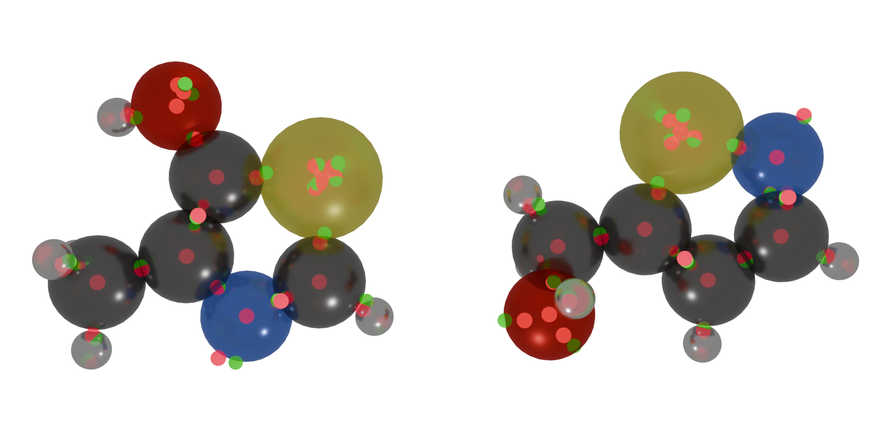

########################
Useful Scripts and Tools
########################

************************************
Utility Codes Repo
************************************

The `NRLMOL_utility_codes <https://github.com/yohyamamoto/NRLMOL_utility_codes>`_ GitHub repository has several useful tools:

:wfout_reader.f90: Convert a binary WFOUT into a human readable format WFOUT2
:wfout_unp2pol_converter.f90: Convert a spin unpolarized WFOUT into a spin polarized WFOUT.
:evalueSmearing.f90: Apply Gaussain smearing on eigenvalues for plotting with gnuplot.
:xmol2cluster.pl: Converts an xmol geometry file to NRLMOL CLUSTER file.
:qchem2cluster.pl: Converts an qchem geometry file to NRLMOL CLUSTER file.
:cluster2xyz.pl: Converts NRLMOL CLUSTER file to xyz file.
:benchmark_libxc.sh: shell script testing suite code for the UTEP-NRLMOL code (written for old versions around 2015-2017).
:nrlmol2molden.f90: Converts NRLMOL output to molden file

************************************
Visualization Tools
************************************

`Atomic Simulation Environment (ASE) <https://wiki.fysik.dtu.dk/ase/index.html>`_

This easy to use visualization helps with quick editing and visualization that can be executed from the command line.

.. code-block:: shell

    ase gui file.xyz

.. figure:: images/ase.png

    Sample output of visualizing an .xyz file with ASE.

`Visual Molecular Dynamics (VMD) <https://www.ks.uiuc.edu/Research/vmd/>`_

This software contains logical visualization, where you can create an image of only atoms of a certain category or type. You can also easily superimpose alternative views of a system (e.g. display ribbons and balls/sticks at once), and easily colorize the

`Atomic Blender Extension <https://extensions.blender.org/add-ons/atomic-blender-pdb-xyz/>`_

With the atomic blender extension for the `Blender <https://www.blender.org/>`_ software, you can create very high quality visuals. The only downside is that Blender has a high learning curve, but you can see a few examples of visuals done in Blender.

.. figure:: images/angle_add.png
   :scale: 18%

   This figure shows how FODs create tetrahedra, or pyramids, in their SP3 form.

        Sample isomers with FODs, rendered with Blender.

.. dropdown:: Blender Learning
   :color: secondary
   :icon: unlock

   You need to learn how to manipulate cameras in Blender and how to do basic object manipulation, lighting, mesh editing, and texture editing.
   The first 11 videos in this `tutorial series <https://www.youtube.com/playlist?list=PL3GeP3YLZn5hhfaGRSmRia0OwPPMfJu0V>`_ offers guidance in these basic things.
   Then you can use the extension!

`PyMol <https://pymol.org/>`_

`VESTA <https://pymol.org/>`_
